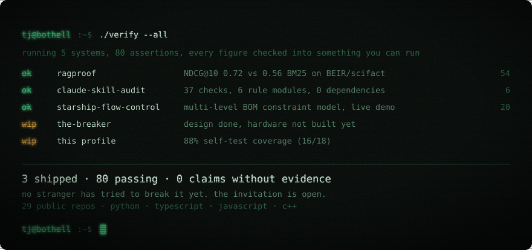
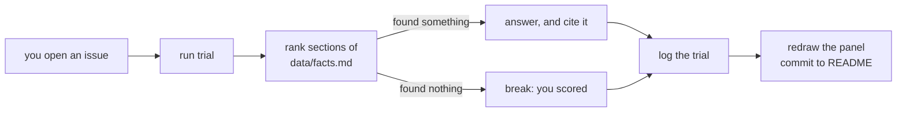

<!--
  README.md is generated from this file. Edit README.tmpl.md, not README.md.
  Rebuild with: node scripts/build.mjs   ·   Gate: npm test
-->

<picture>
  <source media="(prefers-color-scheme: dark)" srcset="assets/hero-dark.svg">
  <source media="(prefers-color-scheme: light)" srcset="assets/hero-light.svg">
  
</picture>

hi, i'm tj. i build applied AI systems, and i build the harnesses that check whether they're telling the truth.

language models are good at language and unreliable at arithmetic. so i put the math in code, the judgement in the model, and a test between them. this page works the same way: every claim has its evidence attached, including the ones that fail.

spent summer 2026 on applied AI at The Coca-Cola Company, Ignite Program, Atlanta. MIS at UW Bothell, class of 2027.

## systems under test

| | what it is | evidence |
| --- | --- | --- |
| **[ragproof](https://github.com/tarang-tj/ragproof)** | RAG evaluation harness. scores retrieval and generation together, because a perfect retriever still fails if the model ignores the context. | 54 tests, CI green. on BEIR/scifact a dense retriever hit NDCG@10 0.72 against 0.56 for BM25. |
| **[claude-skill-audit](https://github.com/tarang-tj/claude-skill-audit)** | security scanner for a whole Claude Code and MCP setup: skills, agents, hooks, permissions. | 37 checks across 6 rule modules, zero runtime dependencies, and a cross-artifact escalation-chain detector nothing else covers. |
| **[starship-flow-control](https://tarang-tj.github.io/starship-flow-control/)** | constraint model over a multi-level bill of materials. finds what actually gates a build instead of what merely looks late. | deterministic engine, fail-loud on unknown references and cycles. 20 tests. live demo on synthetic data, no build step. |
| **[the-breaker](https://github.com/tarang-tj/the-breaker)** | hardware kill-switch for an agent fleet. a guarded switch gates every agent behind a token that expires in seconds, so switch off, dead process and dropped network all fail to HALT. | design complete and open sourced. **the hardware is not built yet** — read it as a design, not a running system. |
| **SyllabusAI** | turns a course syllabus into calendar events in one step. Claude API, Node, Supabase, Google Calendar OAuth. | private repo, and the hosted demo is down while i sort out billing. no link beats a dead one. |

<code>tj@bothell:~$ ./limitations</code>

 

a model card lists what its subject cannot do. so does this one.

the profile runs a daily self-test: **16/18 covered, 88%**. the questions it currently cannot answer from its own facts file:

- Which programming paradigm do you dislike most, and defend that opinion?
- Who could give a reference for your teamwork?

they stay listed until i write the missing fact. that is the point: a gap you can see is worth more than a gap you cannot.

<code>tj@bothell:~$ ./stump --help</code>

 

behind this README is a retrieval harness pointed at [`data/facts.md`](data/facts.md). it ranks the corpus against your question, answers only from what it retrieves, and grades that answer with the same code as [ragproof](https://github.com/tarang-tj/ragproof). no tools, no web access, no guessing.

a question the corpus cannot cover is a failing test. one click files it, question and title already filled in:

[what does claude-skill-audit scan for?](https://github.com/tarang-tj/tarang-tj/issues/new?template=stump.yml&title=stump%3A%20what%20does%20claude-skill-audit%20scan%20for%3F&question=what%20does%20claude-skill-audit%20scan%20for%3F)
· [how does the-breaker fail safe?](https://github.com/tarang-tj/tarang-tj/issues/new?template=stump.yml&title=stump%3A%20how%20does%20the-breaker%20fail%20safe%3F&question=how%20does%20the-breaker%20fail%20safe%3F)
· [what gates a build in starship-flow-control?](https://github.com/tarang-tj/tarang-tj/issues/new?template=stump.yml&title=stump%3A%20what%20gates%20a%20build%20in%20starship-flow-control%3F&question=what%20gates%20a%20build%20in%20starship-flow-control%3F)
· [what is the hardest bug tj has debugged?](https://github.com/tarang-tj/tarang-tj/issues/new?template=stump.yml&title=stump%3A%20what%20is%20the%20hardest%20bug%20tj%20has%20debugged%3F&question=what%20is%20the%20hardest%20bug%20tj%20has%20debugged%3F)

or [write your own](https://github.com/tarang-tj/tarang-tj/issues/new?template=stump.yml&title=stump%3A+).

**0** trials · **n/a** answered · **0** gaps open.

_nothing open right now. every question anyone has asked is covered by the facts file._

**who found a gap**

_no one has stumped it yet._

<code>tj@bothell:~$ ls ~/repos</code>

 

- [economic-pulse-dashboard](https://github.com/tarang-tj/economic-pulse-dashboard) — 7 FRED indicators, pandas ETL, trend detection, Streamlit
- [Cohort-Retention-Engine](https://github.com/tarang-tj/Cohort-Retention-Engine) — event CSV in, retention matrix and churn curves out
- [Bottleneck-Simulator](https://github.com/tarang-tj/Bottleneck-Simulator) — discrete-event simulation of multi-stage workflows with SimPy
- [ecommerce-sql](https://github.com/tarang-tj/ecommerce-sql) — CLV, market basket and rolling revenue windows on a normalized PostgreSQL schema
- [Coke-Recap](https://tarang-tj.github.io/Coke-Recap/) — interactive 3D recap of the Coca-Cola internship, React Three Fiber
- [operations-forecasting-model](https://github.com/tarang-tj/operations-forecasting-model) — multivariate regression and a 15+ metric KPI dashboard
- [wa-housing-homelessness](https://github.com/tarang-tj/wa-housing-homelessness) — R analysis of rent and homelessness in Washington State
- [3d-ramenshop-portfolio](https://tarang-tj.github.io/3d-ramenshop-portfolio/) — hand-coded Three.js ramen shop, single file, no build step

<code>tj@bothell:~$ man profile</code>

 

two GitHub Actions, no server, no third-party services, zero runtime dependencies.

the panel at the top is an SVG this repo draws itself. it is **static on purpose**: an SVG that GitHub
embeds as an image runs in secure static mode, where declarative animation is disabled, so neither CSS
keyframes nor SMIL will ever run there. i checked that against a browser rather than trusting a blog
post — a plain HTML div running the same keyframes animated fine while the identical animation inside
an image sat on frame one. so the craft is all rendering: gradients, a gaussian-blur phosphor glow,
turbulence grain, a scanline pattern and a vignette. two themes, because a dark terminal pasted onto a
white page looks broken.

a trial counts as a break when retrieval finds **nothing** in the corpus. that is deterministic rather
than a judgement about how the model phrased itself, so the score cannot be gamed by wording, and the
model cannot quietly rescue a question the facts do not cover.

when a model writes the answer, the answer is scored too. `faithfulness` is the same algorithm and the
same 0.55 threshold as [ragproof](https://github.com/tarang-tj/ragproof), run with the hash embedder
from that repo's own test suite so the workflow needs no model download. that embedder only counts word
overlap, so the number is a lexical-overlap proxy, not an entailment check: it is paraphrase-blind and
negation-blind, and an answer that borrows corpus wording while saying something false would still score
well. read it as a smoke alarm, not a verdict. extractive answers are not scored at all, since they are
copied corpus text and would sit at 1.0 by construction. so far: **0** model-written answers
scored, mean grounding proxy **n/a**.

- `scripts/render-hero.mjs` — draws the terminal in both themes
- `scripts/lib/retrieve.mjs` — ranks facts against a question, and doubles as the answer path when no
  model key is set, so the bot degrades to retrieval rather than to silence
- `scripts/lib/ragproof-metrics.mjs` — faithfulness and relevance, ported from ragproof so the profile
  grades itself with the code it ships elsewhere
- `scripts/lib/eval-log.mjs` — replays every past break against the current corpus, so a gap counts as
  closed only once the facts genuinely cover it
- `scripts/build.test.mjs` — the gate. an unsubstituted token, a lost theme, glow leaking into the
  printout, or a row dropped from the panel while the summary still counts it all fail here

the model never gets tools, never sees anything outside `data/facts.md`, and every question is treated
as untrusted input and stripped of markup before it is written anywhere. worst case it says "i don't
know", which here is a scoring event rather than a failure.

anything a stranger writes ends up on a page with my name on it, so moderation stays human: a junk trial
comes off the board by deleting its entry from `data/eval.json` and closing the issue. the score is
honest, not automatic.

---

[portfolio](https://tarang-tj.github.io) · [linkedin](https://www.linkedin.com/in/tarang-tj/) · 29 public repos · 9 stars · Python · TypeScript · JavaScript · C++

open to applied AI and forward deployed engineering roles starting June 2027.
