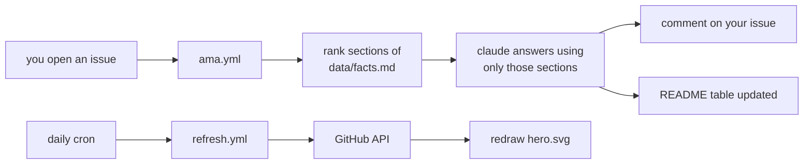

<!--
  README.md is generated from this file. Edit README.tmpl.md, not README.md.
  Rebuild with: node scripts/build.mjs
-->

hi, i'm tj. i build applied AI systems, and i build the things that check whether they're telling the truth.

right now that's [ragproof](https://github.com/tarang-tj/ragproof), an open source RAG evaluation harness: retrieval metrics, answer faithfulness, and drift detection, benchmarked on BEIR.

applied AI and martech at The Coca-Cola Company, Ignite Program, Atlanta. MIS at UW Bothell, class of 2027.

## ask this README a question

this profile answers questions. open an issue, and a GitHub Action retrieves the relevant facts, has a model answer using only those facts, and posts the answer back in about a minute. it cites what it used. if the answer isn't in [`data/facts.md`](data/facts.md), it says so instead of making something up. same rule i hold my own systems to.

[**→ ask a question**](https://github.com/tarang-tj/tarang-tj/issues/new?template=ask.yml&title=ask%3A+) &nbsp;·&nbsp; try _"what does ragproof actually measure?"_ or _"what's the hardest thing you've shipped?"_

_No questions yet. Be the first: the bot answers within about a minute._

## selected work

|  |  |
| --- | --- |
| **[ragproof](https://github.com/tarang-tj/ragproof)**   RAG evaluation harness. retrieval metrics, answer faithfulness, drift detection, benchmarked on BEIR. | **[the-breaker](https://github.com/tarang-tj/the-breaker)**   a physical dead-man kill-switch for an autonomous agent fleet. guarded switch to Raspberry Pi authority tokens, fails safe to HALT. |
| **[claude-skill-audit](https://github.com/tarang-tj/claude-skill-audit)**   audit an entire Claude Code setup in one command. prompt-injection, supply-chain, and secret-exposure risks. zero dependencies. | **[SyllabusAI](https://syllabusai.net)**   turns a course syllabus into a calendar import in one step.|
| **[ecommerce-sql](https://github.com/tarang-tj/ecommerce-sql)**   end-to-end analytics on a normalized schema: CLV, market basket, rolling revenue windows in PostgreSQL. | **[portfolio](https://tarang-tj.github.io)**   hand-coded interactive 3D site. Three.js, vanilla JS, no framework. |

<b>how this README works</b>

 

two GitHub Actions and no third-party services. the panel at the top is an SVG this repo draws itself. the numbers come from the GitHub API, so the profile can't drift from what's actually in the repos.

- `scripts/collect-stats.mjs`: pulls repo counts, stars, and language mix from the API
- `scripts/render-hero.mjs`: draws the panel. it is deliberately static: GitHub embeds README SVGs through an img tag, which renders them frozen at the first frame, so anything that fades in never arrives
- `scripts/lib/retrieve.mjs`: ranks facts against the question. also the fallback answer path when no model key is set, so the bot degrades to retrieval rather than to silence
- `scripts/ama.mjs`: grounded answer, then the comment and the table

the model never gets tools, never sees anything outside `data/facts.md`, and questions are treated as untrusted input. worst case it says "i don't know."

<b>more repos</b>

 

- [economic-pulse-dashboard](https://github.com/tarang-tj/economic-pulse-dashboard): 7 FRED indicators, pandas ETL, trend detection, Streamlit
- [Cohort-Retention-Engine](https://github.com/tarang-tj/Cohort-Retention-Engine): event CSV in, retention matrix and churn curves out
- [Bottleneck-Simulator](https://github.com/tarang-tj/Bottleneck-Simulator): discrete-event simulation of multi-stage workflows with SimPy
- [Coke-Recap](https://github.com/tarang-tj/Coke-Recap): interactive 3D recap of the Coca-Cola internship, React Three Fiber
- [3d-ramenshop-portfolio](https://github.com/tarang-tj/3d-ramenshop-portfolio): single-file Three.js scene
- [operations-forecasting-model](https://github.com/tarang-tj/operations-forecasting-model): multivariate regression and a 15+ metric KPI dashboard
- [wa-housing-homelessness](https://github.com/tarang-tj/wa-housing-homelessness): R analysis of rent and homelessness in Washington State, Zillow ZORI and HUD PIT data

## elsewhere

[portfolio](https://tarang-tj.github.io) · [linkedin](https://www.linkedin.com/in/tarang-tj/) · working in TypeScript · Python · JavaScript · SQL

open to applied AI and forward deployed engineering roles starting June 2027.
