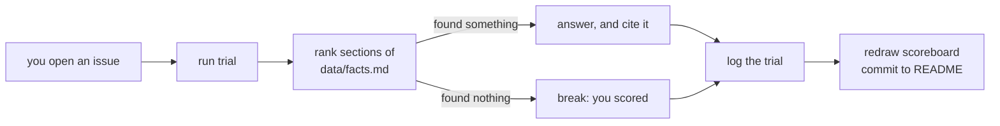

<!--
  README.md is generated from this file. Edit README.tmpl.md, not README.md.
  Rebuild with: node scripts/build.mjs
-->

hi, i'm tj. i build applied AI systems, and i build the harnesses that check whether they're telling the truth.

right now that's [ragproof](https://github.com/tarang-tj/ragproof), an open source RAG evaluation harness: retrieval metrics, answer faithfulness, and drift detection, benchmarked on BEIR.

applied AI and martech at The Coca-Cola Company, Ignite Program, Atlanta. MIS at UW Bothell, class of 2027.

## add a failing test case

behind this README is a retrieval harness pointed at [`data/facts.md`](data/facts.md). it
ranks the corpus against your question, answers only from what it retrieves, and grades that
answer with the same code as [ragproof](https://github.com/tarang-tj/ragproof). no tools, no
web access, no guessing.

a question the corpus can't cover is a failing test. it goes on the list below until i write
the missing fact. one click files it, question and title already filled in:

[what does claude-skill-audit scan for?](https://github.com/tarang-tj/tarang-tj/issues/new?template=stump.yml&title=stump%3A%20what%20does%20claude-skill-audit%20scan%20for%3F&question=what%20does%20claude-skill-audit%20scan%20for%3F)
· [how does the-breaker fail safe?](https://github.com/tarang-tj/tarang-tj/issues/new?template=stump.yml&title=stump%3A%20how%20does%20the-breaker%20fail%20safe%3F&question=how%20does%20the-breaker%20fail%20safe%3F)
· [which database does ecommerce-sql use?](https://github.com/tarang-tj/tarang-tj/issues/new?template=stump.yml&title=stump%3A%20which%20database%20does%20ecommerce-sql%20use%3F&question=which%20database%20does%20ecommerce-sql%20use%3F)
· [what is the portfolio built with?](https://github.com/tarang-tj/tarang-tj/issues/new?template=stump.yml&title=stump%3A%20what%20is%20the%20portfolio%20built%20with%3F&question=what%20is%20the%20portfolio%20built%20with%3F)
· [what is the hardest bug tj has debugged?](https://github.com/tarang-tj/tarang-tj/issues/new?template=stump.yml&title=stump%3A%20what%20is%20the%20hardest%20bug%20tj%20has%20debugged%3F&question=what%20is%20the%20hardest%20bug%20tj%20has%20debugged%3F)

or [write your own](https://github.com/tarang-tj/tarang-tj/issues/new?template=stump.yml&title=stump%3A+).
**0** trials · **n/a** answered · **0** gaps open.

### gaps it hasn't closed yet

_nothing open right now. every question anyone has asked is covered by the facts file._

### daily self-test: 14/18 covered, 77%

- What is a project that failed, and what did you take away from it?
- What compensation are you expecting for a full time offer?
- Which programming paradigm do you dislike most, and defend that opinion?
- Who could give a reference for your teamwork?

### who found a gap

_no one has stumped it yet._

## selected work

|  |  |
| --- | --- |
| **[ragproof](https://github.com/tarang-tj/ragproof)**   RAG evaluation harness. retrieval metrics, answer faithfulness, drift detection, benchmarked on BEIR. | **[the-breaker](https://github.com/tarang-tj/the-breaker)**   a physical dead-man kill-switch for an autonomous agent fleet. guarded switch to Raspberry Pi authority tokens, fails safe to HALT. |
| **[claude-skill-audit](https://github.com/tarang-tj/claude-skill-audit)**   audit an entire Claude Code setup in one command. prompt-injection, supply-chain, and secret-exposure risks. zero dependencies. | **SyllabusAI**   turns a course syllabus into a calendar import in one step.|
| **[ecommerce-sql](https://github.com/tarang-tj/ecommerce-sql)**   end-to-end analytics on a normalized schema: CLV, market basket, rolling revenue windows in PostgreSQL. | **[portfolio](https://tarang-tj.github.io)**   hand-coded interactive 3D site. Three.js, vanilla JS, no framework. |

<b>how this README works</b>

 

two GitHub Actions, no server, no third-party services. the scoreboard at the top is an
SVG this repo draws itself, one mark per trial, the way a test runner prints one
character per test.

a trial counts as a break when retrieval finds **nothing** in the corpus. that's a
deterministic condition rather than a judgement about how the model phrased itself, so
the score can't be gamed by wording, and the model can't quietly rescue a question the
facts don't actually cover.

when the model writes the answer, the answer itself also gets scored. `faithfulness` is the
same algorithm and the same 0.55 threshold as
[ragproof](https://github.com/tarang-tj/ragproof), run here with the hash embedder from that
repo's own test suite so the workflow needs no model download. that embedder only counts
word overlap, so the number is a lexical-overlap proxy against the retrieved facts rather
than an entailment check: it is paraphrase-blind and negation-blind, and an answer that
borrows corpus wording while saying something false would still score well. read it as a
smoke alarm, not a verdict. extractive answers are not scored at all, since they are copied
corpus text and would sit at 1.0 by construction. so far: **0** model-written
answers scored, mean grounding proxy **n/a**.

- `scripts/collect-stats.mjs`: repo counts, stars and language mix from the GitHub API
- `scripts/render-hero.mjs`: draws the scoreboard. every element's resting state is its
  finished state, so a still frame of the panel is already complete
- `scripts/lib/retrieve.mjs`: ranks facts against the question, and doubles as the answer
  path when no model key is set, so the bot degrades to retrieval rather than to silence
- `scripts/lib/ragproof-metrics.mjs`: the faithfulness and relevance scoring, ported from
  ragproof so the profile grades itself with the same code it ships elsewhere
- `scripts/lib/eval-log.mjs`: scoring. it replays every past break against the current
  corpus, so a gap counts as closed only once the facts genuinely cover it
- `scripts/run-trial.mjs`: one trial, start to finish

the model never gets tools, never sees anything outside `data/facts.md`, and every
question is treated as untrusted input and stripped of markup before it is written
anywhere. worst case it says "i don't know", which here is a scoring event rather than
a failure.

anything a stranger writes ends up on a page with my name on it, so moderation stays
human: a junk trial comes off the board by deleting its entry from `data/eval.json`
and closing the issue. the score is honest, not automatic.

<b>more repos</b>

 

- [economic-pulse-dashboard](https://github.com/tarang-tj/economic-pulse-dashboard): 7 FRED indicators, pandas ETL, trend detection, Streamlit
- [Cohort-Retention-Engine](https://github.com/tarang-tj/Cohort-Retention-Engine): event CSV in, retention matrix and churn curves out
- [Bottleneck-Simulator](https://github.com/tarang-tj/Bottleneck-Simulator): discrete-event simulation of multi-stage workflows with SimPy
- [Coke-Recap](https://github.com/tarang-tj/Coke-Recap): interactive 3D recap of the Coca-Cola internship, React Three Fiber
- [3d-ramenshop-portfolio](https://github.com/tarang-tj/3d-ramenshop-portfolio): single-file Three.js scene
- [operations-forecasting-model](https://github.com/tarang-tj/operations-forecasting-model): multivariate regression and a 15+ metric KPI dashboard
- [wa-housing-homelessness](https://github.com/tarang-tj/wa-housing-homelessness): R analysis of rent and homelessness in Washington State, Zillow ZORI and HUD PIT data

## elsewhere

[portfolio](https://tarang-tj.github.io) · [linkedin](https://www.linkedin.com/in/tarang-tj/) · 20 public repos · working in Python · TypeScript · JavaScript · C++

open to applied AI and forward deployed engineering roles starting June 2027.
